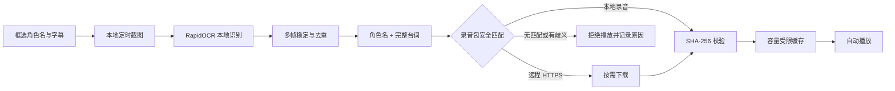

# Genshin_autoTTS

[](https://github.com/uinaqx/Genshin_autoTTS/actions/workflows/ci.yml)
[](https://github.com/uinaqx/Genshin_autoTTS/releases/latest)
[](https://github.com/uinaqx/Genshin_autoTTS/releases)
[](LICENSE)
[](#系统要求)

面向 Windows 的轻量游戏剧情配音伴侣：从屏幕画面中识别角色名和字幕，在字幕稳定后播放录音包中与“角色 + 台词”安全匹配的真人录音。

> [!IMPORTANT]
> 本项目是非官方外部辅助工具，与米哈游、HoYoverse 或《原神》无关联。它不注入游戏进程、不读取游戏内存、不修改游戏文件，也不包含或分发游戏截图、台词库或官方音频。请自行确认录音包授权与游戏服务条款。

## 下载

普通用户无需安装 Python。推荐使用安装版；便携版适合免安装运行或放在移动硬盘中使用。

| 版本 | 下载 | 说明 |
| --- | --- | --- |
| Windows 安装版 x64 | **[下载最新版安装程序](https://github.com/uinaqx/Genshin_autoTTS/releases/latest/download/Genshin_autoTTS-Setup-x64.exe)** | 当前用户安装，创建开始菜单入口，可选桌面快捷方式 |
| Windows 便携版 x64 | [下载最新版便携包](https://github.com/uinaqx/Genshin_autoTTS/releases/latest/download/Genshin_autoTTS-Portable-x64.zip) | 解压整个 ZIP 后运行，不写入安装目录外的程序文件 |
| SHA-256 校验 | [下载 SHA256SUMS.txt](https://github.com/uinaqx/Genshin_autoTTS/releases/latest/download/SHA256SUMS.txt) | 用于核对安装包与便携包完整性 |
| 发布说明 | [查看最新 Release](https://github.com/uinaqx/Genshin_autoTTS/releases/latest) | 版本变化、已知问题和全部附件 |

当前社区构建未购买代码签名证书，Windows 可能显示“未知发布者”。请只从本仓库 Release 下载，并在需要时使用 `SHA256SUMS.txt` 校验；不要从第三方网盘获取安装包，也不要为运行本软件关闭系统安全功能。

## 功能

- **本地屏幕 OCR**：截图和识别均在本机完成，默认不上传画面或识别文本。
- **真实对话布局**：支持常见底部字幕、上移字幕、选项干扰和超宽画面布局。
- **逐字字幕稳定**：等待多帧稳定后再触发，避免半句话就开始播放。
- **保守录音匹配**：优先精确匹配；只有角色一致、长句高度相似且候选唯一时才纠正少量 OCR 漏字。
- **严格真人录音模式**：没有匹配录音或校验失败时明确拒绝播放，不用机器语音冒充真人录音。
- **轻量按需缓存**：远程条目仅在首次命中时通过 HTTPS 下载，并使用容量受限的 LRU 缓存。
- **完整性校验**：每条录音在播放前校验 SHA-256，远程单文件限制为 20 MB。
- **可视化诊断**：提供截屏识别、真实截图批量诊断、录音测试、缓存管理和运行日志。

## 开箱即用内容

安装版和便携版已经包含运行程序所需的组件，不需要用户另外配置 Python 环境：

| 内置资源 | 用途 |
| --- | --- |
| Python 3.11 运行时与依赖 | 直接运行桌面程序 |
| RapidOCR 与 3 个 ONNX 模型 | 本地识别中文角色名和字幕 |
| 正式版深色桌面界面 | 配置、诊断、启动和查看日志 |
| 全屏 16:9 区域预设 | 常见分辨率的快速初始配置 |
| 模拟剧情画面工具 | 在不启动游戏时测试框选和 OCR |
| 本地截图批量诊断 | 使用自己的剧情截图检查识别兼容性 |
| 合法真人诊断音频 | 验证“匹配 → 校验 → 缓存 → 播放”链路 |
| 中文快速指南与示例配置 | 离线查看操作和参数说明 |

内置真人诊断音频是 Jackson 录制的英语单词 `zero`，来自 Free Spoken Digit Dataset v1.0.10，采用 CC BY-SA 4.0，详见 [`SAMPLE_AUDIO_LICENSE.md`](SAMPLE_AUDIO_LICENSE.md)。它仅用于验证播放链路，不是游戏配音资源。

## 工作原理



程序只观察用户指定的屏幕区域，不模拟键鼠操作，也不与游戏进程通信。

## 系统要求

- Windows 10 或 Windows 11，64 位 x86 设备
- 建议至少 4 GB 内存
- 安装或解压约需 400 MB 可用空间
- 建议游戏使用“窗口化”或“无边框窗口”模式
- 严格真人模式可离线运行；只有远程录音首次命中时需要联网

## 安装

### 安装版（推荐）

1. 下载 [`Genshin_autoTTS-Setup-x64.exe`](https://github.com/uinaqx/Genshin_autoTTS/releases/latest/download/Genshin_autoTTS-Setup-x64.exe)。
2. 运行安装程序，按向导完成当前用户安装，不需要管理员权限。
3. 从开始菜单启动 `Genshin_autoTTS`。

### 便携版

1. 下载 [`Genshin_autoTTS-Portable-x64.zip`](https://github.com/uinaqx/Genshin_autoTTS/releases/latest/download/Genshin_autoTTS-Portable-x64.zip)。
2. 将 ZIP 完整解压到可写目录；不要只复制其中的单个 EXE。
3. 运行 `Genshin_autoTTS\Genshin_autoTTS.exe`。

### 校验下载文件

在 PowerShell 中执行：

```powershell
Get-FileHash .\Genshin_autoTTS-Setup-x64.exe -Algorithm SHA256
Get-Content .\SHA256SUMS.txt
```

输出摘要应与 `SHA256SUMS.txt` 中对应文件完全一致。

## 使用指南

### 三分钟开始

1. 将游戏设为窗口化或无边框窗口模式。
2. 进入一段没有配音的对话，并让完整字幕停留在屏幕上。
3. 启动软件，先点击“全屏 16:9 预设”。如果游戏分辨率或 UI 缩放不同，再分别框选角色名和字幕区域。
4. 点击“截屏识别测试”，确认日志中能识别角色与完整台词。
5. 在“录音包清单”中选择自己拥有合法授权的 `manifest.json`。留空时使用内置诊断包。
6. 先运行真人诊断音频，确认扬声器正常，然后点击“开始自动配音”并切回游戏。

框选范围应尽量紧，避开头像、任务提示、交互按钮和背景文字。分辨率、显示缩放或游戏 UI 缩放改变后，需要重新框选。

### 测试真实截图

在软件中点击“本地真实截图批量诊断”，选择自己保存的剧情截图。程序会逐张输出识别布局、角色和台词；截图只在本机读取，不会复制到运行目录或上传。

### 测试模拟剧情

点击“打开模拟剧情工具”可启动贴近游戏字幕排版的测试窗口。按 `Space`、左/右方向键切换对话，按 `A` 自动播放，按 `Esc` 退出。可使用主界面的框选与截屏测试验证完整流程。

更完整的离线指南见 [`docs/QUICKSTART.zh-CN.md`](docs/QUICKSTART.zh-CN.md)。

## 录音包

世界任务完整覆盖取决于合法的真人录音资源。程序本身不会从任意文本生成真人声音，也不会附带来源不明的角色音色模型。

最小录音包清单：

```json
{
  "format_version": 1,
  "pack_id": "my-authorized-pack",
  "pack_version": "2026.07",
  "license": "录音包许可证或授权说明",
  "entries": [
    {
      "speaker": "角色名",
      "text": "对应的完整台词",
      "url": "https://example.com/audio/line-0001.opus",
      "sha256": "64位小写十六进制摘要",
      "codec": "opus",
      "recorded_by": "配音者或授权标识",
      "source_url": "https://example.com/license"
    }
  ]
}
```

每个条目必须且只能提供一个来源：

- `path`：相对于 `manifest.json` 的本地路径，且不能越出录音包目录。
- `url`：HTTPS 地址，首次命中时下载，之后从本机缓存播放。

支持 `wav`、`mp3`、`ogg`、`opus`。每个条目必须提供 SHA-256；短句、跨角色、低相似度或多个接近候选都会被拒绝，避免播错剧情。

大型录音包建议按任务或章节拆分清单，并将音频独立托管。用户只下载实际遇到的台词，无需保存十几 GB 的全量语音包。

## 配置与数据目录

运行数据默认保存到：

```text
%LOCALAPPDATA%\GenshinAutoTTS\
├── config.json
└── cache\
    ├── cache.sqlite3
    └── objects\
```

主要参数见 [`config.example.json`](config.example.json)：

| 参数 | 默认值 | 作用 |
| --- | ---: | --- |
| `ocr_interval_ms` | `300` | 截图识别间隔 |
| `stability_frames` | `3` | 连续稳定多少帧才触发 |
| `minimum_stable_ms` | `600` | 字幕至少稳定多久 |
| `repeat_cooldown_seconds` | `8` | 相同角色与台词的防重复时间 |
| `tts_provider` | `recorded` | 默认严格真人录音模式 |
| `voice_pack_manifest` | `null` | 自定义清单；空值使用诊断包 |
| `cache_max_mb` | `256` | 本地音频缓存上限 |

如需改变数据位置，可在启动前设置：

```powershell
$env:GENSHIN_AUTOTTS_HOME = "D:\GenshinAutoTTSData"
```

## 隐私与安全

- 严格真人模式不会上传截图或识别文本。
- 远程录音只允许 HTTPS，并受下载超时、体积限制与 SHA-256 校验保护。
- 第三方录音包应视为不可信输入；使用前检查授权、来源、角色、台词和摘要。
- 可选的 `edge` 实验模式会把文本发送给 Microsoft 语音服务，它不是默认模式，也不包含在核心流程中。
- 安全问题请按 [`SECURITY.md`](SECURITY.md) 私下报告，不要在公开 Issue 中提交账号、截图、令牌或未授权音频。

## 已知限制

- 完整剧情覆盖取决于录音包，软件无法凭空补齐真人录音。
- 严重动态模糊、极小字号、过度压缩和特殊滤镜仍可能降低 OCR 准确率。
- 当前依赖用户设置或框选角色名与字幕区域，尚未自动适配所有游戏 UI。
- 保守匹配可能漏播，但不会为了提高命中率而冒险播放歧义录音。
- Windows 安装包目前没有商业代码签名，首次运行可能出现信誉提示。

## 从源码运行

开发者可使用 Python 3.10、3.11 或 3.12：

```powershell
python -m venv .venv
.\.venv\Scripts\python -m pip install --upgrade pip
.\.venv\Scripts\python -m pip install -e ".[dev]"
.\.venv\Scripts\genshin-autotts-gui.exe
```

常用诊断命令：

```powershell
.\.venv\Scripts\genshin-autotts.exe smoke
.\.venv\Scripts\genshin-autotts.exe fixture
.\.venv\Scripts\genshin-autotts.exe qa "D:\GenshinScreenshots"
```

测试与构建：

```powershell
.\.venv\Scripts\python -m ruff check .
.\.venv\Scripts\python -m pytest
.\.venv\Scripts\python -m pip install -e ".[build]"
.\scripts\build_release.ps1 -Version 0.3.0
```

推送符合 `v*.*.*` 的标签时，[Release 工作流](.github/workflows/release.yml)会在 Windows Runner 上构建、自检并发布安装包、便携包和 SHA-256 文件。

## 参与项目

- 提交代码前请阅读 [`CONTRIBUTING.md`](CONTRIBUTING.md)。
- 功能建议和可公开复现的问题可提交 [Issue](https://github.com/uinaqx/Genshin_autoTTS/issues)。
- 请勿提交游戏文件、提取文本、模型权重、未授权音频、截图、账号信息、缓存或令牌。

## 许可证

源代码使用 [MIT License](LICENSE)。内置诊断音频单独使用 CC BY-SA 4.0，详见 [`SAMPLE_AUDIO_LICENSE.md`](SAMPLE_AUDIO_LICENSE.md)。这些许可证不授予任何第三方游戏内容、商标、角色、音频或模型的权利。
