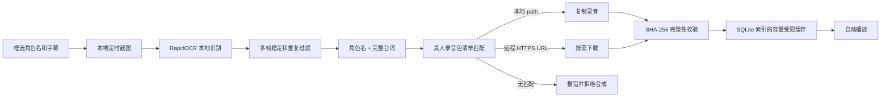

# Genshin_autoTTS

一个轻量、开源的 Windows 游戏自动配音伴侣。程序只读取屏幕像素，通过 OCR 识别角色名和字幕，再播放录音包中与“角色 + 台词”匹配的真人录音。

默认的 `recorded` 严格模式**不运行 TTS，也不生成声音**。没有匹配录音、文件被篡改或下载失败时，程序会明确报错，绝不会用机器语音补位。

> 本项目是非官方辅助工具，与米哈游、HoYoverse 或《原神》无关联。它不注入游戏进程、不读取游戏内存、不修改游戏文件，也不包含或分发《原神》台词或音频。使用者应自行确认录音包的来源、授权以及游戏服务条款。

## 工作流程



- OCR 完全在本机运行，不上传截图。
- 针对逐字出现的游戏字幕做多帧稳定，避免播放半句话。
- 录音包使用 JSON 清单；同一角色、同一台词只匹配一条真人录音。
- 每条录音必须声明 SHA-256，播放前强制校验。
- 远程条目仅允许 HTTPS，并设置超时和单文件 20 MB 上限。
- 只下载实际遇到的台词；默认缓存上限 256 MB，LRU 自动清理。
- 更换录音包或版本后缓存命名空间自动改变，不会误播旧包内容。
- 缺少真人录音时停止该条播放，不调用 Edge、SAPI 或其他 TTS。

仓库保留了显式的 `edge` 实验模式，便于比较技术路线；它是合成语音、不是严格模式的一部分，核心安装也不包含其依赖。

## 当前可交付边界

程序链路已经完整，但真人录音无法像 TTS 一样从任意文本即时产生。要覆盖《原神》世界任务，仍需制作或取得“逐角色、逐台词”的合法真人录音包；没有这些录音，软件会按设计拒绝播放。

仓库没有收录《原神》资源。内置的 11 KB 诊断样本只是为了证明“识别 → 真人录音匹配 → 校验 → 缓存 → 播放”链路真实可运行：Jackson 真人录制的英语单词 `zero`，来自 Free Spoken Digit Dataset v1.0.10，采用 CC BY-SA 4.0。详情见 [`SAMPLE_AUDIO_LICENSE.md`](SAMPLE_AUDIO_LICENSE.md)。

## 环境与安装

- Windows 10 或 Windows 11
- Python 3.10、3.11 或 3.12（推荐 3.11）
- 严格真人模式不需要联网；仅远程录音条目在首次命中时需要联网

```powershell
python -m venv .venv
.\.venv\Scripts\python -m pip install --upgrade pip
.\.venv\Scripts\python -m pip install -e .
```

开发与测试环境：

```powershell
.\.venv\Scripts\python -m pip install -e ".[dev]"
```

只有在明确需要可选的合成音实验模式时才安装：

```powershell
.\.venv\Scripts\python -m pip install -e ".[synthetic]"
```

## 使用

启动桌面程序：

```powershell
.\.venv\Scripts\genshin-autotts-gui.exe
```

1. 将游戏设置为窗口化或无边框窗口模式。
2. 在无配音对话停留时，框选角色名区域和字幕区域。
3. 在“录音包清单”选择自己的 `manifest.json`；留空会使用内置诊断样本。
4. 先用“全流程测试”播放 `真人示例 / zero`，确认系统扬声器可用。
5. 点击“开始自动配音”。

框选范围应尽量紧，不要包含头像、按钮和背景文字。分辨率或 UI 缩放改变后需要重新框选。

### 命令行检查

播放内置真人诊断样本：

```powershell
.\.venv\Scripts\genshin-autotts.exe demo --speaker 真人示例 --text zero --play
```

使用自定义录音包：

```powershell
.\.venv\Scripts\genshin-autotts.exe demo `
  --speaker 派蒙 `
  --text "旅行者，我们出发吧！" `
  --voice-pack "D:\VoicePack\manifest.json" `
  --play
```

运行真实 OCR、真人录音、SHA-256 与二次缓存命中测试：

```powershell
.\.venv\Scripts\genshin-autotts.exe smoke
```

启动可供人工框选的字幕场景：

```powershell
.\.venv\Scripts\genshin-autotts.exe fixture
```

## 真人录音包格式

最小清单示例：

```json
{
  "format_version": 1,
  "pack_id": "my-recorded-pack",
  "pack_version": "2026.07",
  "license": "录音包许可证或授权说明",
  "entries": [
    {
      "speaker": "派蒙",
      "text": "旅行者，我们出发吧！",
      "url": "https://example.com/audio/line-0001.opus",
      "sha256": "64位小写十六进制摘要",
      "codec": "opus",
      "recorded_by": "配音者或授权标识",
      "source_url": "https://example.com/license"
    }
  ]
}
```

每个条目必须且只能提供一个音频来源：

- `path`：相对于 `manifest.json` 的本地路径，且不能越出录音包目录。
- `url`：HTTPS 下载地址，首次遇到台词时下载，后续从本机缓存播放。

支持 `wav`、`mp3`、`ogg`、`opus`。匹配前会规范化全角字符和空白，但不会模糊替换台词；角色或文本不一致就视为缺失，避免播错剧情。

生产录音包建议以任务或章节拆分清单，并把每段音频独立托管。这样用户无需下载十几 GB 全量包，只会保存自己实际遇到的内容。

## 本地存储

运行数据默认位于：

```text
%LOCALAPPDATA%\GenshinAutoTTS\
├── config.json
└── cache\
    ├── cache.sqlite3
    └── objects\
```

测试或便携运行可改位置：

```powershell
$env:GENSHIN_AUTOTTS_HOME = "D:\GenshinAutoTTSData"
```

主要配置见 [`config.example.json`](config.example.json)：

| 参数 | 默认值 | 作用 |
| --- | ---: | --- |
| `ocr_interval_ms` | 300 | 截图识别间隔 |
| `stability_frames` | 3 | 连续稳定多少帧才触发 |
| `minimum_stable_ms` | 600 | 字幕至少稳定多久 |
| `repeat_cooldown_seconds` | 8 | 相同角色与台词的防重复时间 |
| `tts_provider` | `recorded` | 严格真人录音模式 |
| `voice_pack_manifest` | `null` | 自定义录音包清单；空值使用诊断包 |
| `cache_max_mb` | 256 | 本地音频缓存上限 |

## 已知限制

- 世界任务完整覆盖取决于合法真人录音包，软件本身不能凭空补齐录音。
- OCR 对透明字幕、复杂背景、动态模糊和极小字号较敏感。
- 当前使用两个固定屏幕区域，不自动检测不同游戏的对话框位置。
- 台词匹配是保守的；OCR 错字会导致拒绝播放，而不是冒险播错。
- 录音包作者必须处理配音者同意、肖像/声音权益、脚本版权及再分发许可。

## 开发与验证

```powershell
.\.venv\Scripts\python -m ruff check .
.\.venv\Scripts\python -m pytest --cov=genshin_autotts
.\scripts\smoke_test.ps1
```

核心结构：

```text
src/genshin_autotts/
├── capture.py       # 屏幕截图
├── ocr.py           # OCR 与观测源
├── text.py          # 文本规范化、稳定与去重
├── tts.py           # 真人录音包解析、下载、校验；可选 Edge 实验模式
├── cache.py         # SQLite + LRU 音频缓存
├── pipeline.py      # 并发识别/播音流水线
├── sample_voicepack # 11 KB 真人诊断样本
└── ui.py            # Tkinter 桌面界面与区域框选
```

源代码使用 [MIT License](LICENSE)。内置诊断音频单独采用 CC BY-SA 4.0，详见样本许可文件。许可证不授予任何第三方游戏内容、商标、角色、音频或模型的权利。
